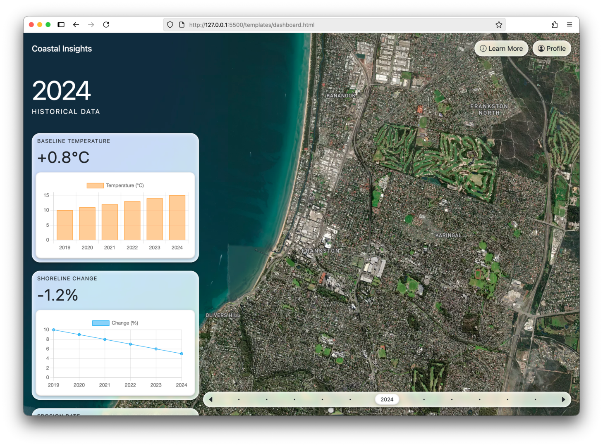

# Coastal Insights Platform

The Coastal Insights Platform is a web-based application, providing a front-end interface to an external coastline prediction model.



## Architecture

The application uses a Next.js frontend, and a Django API backend. Docker is used for containerisation.

## Installation

Navigate to the project directory in the terminal and use the following command to start the containers.

```sh
docker compose up
```
